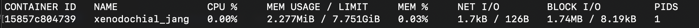

# Session 1

## Introduction aux Containers et à la Sécurité

### 1. Lancement d'un Container Simple


Nous pouvons observer les étapes suivantes exécutées par Docker :
1. Le client Docker a contacté le démon Docker.
2. Le démon Docker a récupéré l'image "hello-world" depuis Docker Hub.
3. Le démon Docker a créé un nouveau conteneur à partir de cette image, exécutant le programme qui produit la sortie que vous lisez actuellement.
4. Le démon Docker a transmis cette sortie au client Docker, qui l'a ensuite envoyée à votre terminal.

### 2. Exploration d'un Container en Mode Interactif

Nous allons maintenant lancer un conteneur en mode interactif. Après son lancement, nous pouvons interagir avec le système. En tapant `ls`, nous remarquons que les fichiers ne sont pas les mêmes que ceux de notre système hôte et ressemblent à ceux d'un autre système d'exploitation.


En utilisant la commande `docker stats [nom du conteneur]`, nous pouvons voir les statistiques de consommation des ressources du conteneur, telles que la mémoire RAM et les données réseau en entrée/sortie.

### 3. Analyser les ressources système d’un container



### 4. Lister les capacités d’un container

Enfin, nous pouvons vérifier les permissions du conteneur avec la commande `docker run --rm --cap-add=SYS_ADMIN alpine sh -c 'cat /proc/self/status'`. Pour le conteneur Alpine, les permissions sont les suivantes :

```
Name:	cat
Umask:	0022
State:	R (running)
Tgid:	1
Ngid:	0
Pid:	1
PPid:	0
TracerPid:	0
Uid:	0	0	0	0
Gid:	0	0	0	0
FDSize:	64
Groups:	0 1 2 3 4 6 10 11 20 26 27
NStgid:	1
NSpid:	1
NSpgid:	1
NSsid:	1
Kthread:	0
VmPeak:	    1772 kB
VmSize:	    1740 kB
VmLck:	       0 kB
VmPin:	       0 kB
VmHWM:	     816 kB
VmRSS:	     816 kB
RssAnon:	       0 kB
RssFile:	     816 kB
RssShmem:	       0 kB
VmData:	      84 kB
VmStk:	     132 kB
VmExe:	     840 kB
VmLib:	     652 kB
VmPTE:	      36 kB
VmSwap:	       0 kB
HugetlbPages:	       0 kB
CoreDumping:	0
THP_enabled:	1
untag_mask:	0xffffffffffffff
Threads:	1
SigQ:	0/31724
SigPnd:	0000000000000000
ShdPnd:	0000000000000000
SigBlk:	0000000000000000
SigIgn:	0000000000000004
SigCgt:	0000000000000000
CapInh:	0000000000000000
CapPrm:	00000000a82425fb
CapEff:	00000000a82425fb
CapBnd:	00000000a82425fb
CapAmb:	0000000000000000
NoNewPrivs:	0
Seccomp:	0
Seccomp_filters:	0
Speculation_Store_Bypass:	vulnerable
SpeculationIndirectBranch:	unknown
Cpus_allowed:	ff
Cpus_allowed_list:	0-7
Mems_allowed:	1
Mems_allowed_list:	0
voluntary_ctxt_switches:	16
nonvoluntary_ctxt_switches:	0
```

Ces informations montrent les capacités et les permissions du conteneur, ce qui est crucial pour comprendre et gérer la sécurité des conteneurs. Par exemple, l'element `NoNewPrivs = 0`, d'après la documentation, nous dit que le conteneur pourrait monter en privilèges. Si elle était de 1, elle ne pourrait pas monter en privilège, et donc elle pourrait être plus sûre. 


## Vulnérabilités et Menaces

### 1. Tester un Container avec des Permissions Élevées

Après avoir vu les éléments basiques d'un conteneur, nous pouvons explorer d'autres fonctionnalités. Par exemple, nous pouvons lancer un conteneur en mode privilégié, ce qui lui donne des accès supplémentaires.


Cependant, cela peut être dangereux, car un conteneur privilégié peut plus facilement "s'échapper" et exécuter des commandes directement sur l'hôte, contournant ainsi les mécanismes de sécurité de Docker.

### 2. Simuler une Évasion de Container

Nous allons ensuite essayer d'accéder au système de l'hôte à travers un conteneur.

```sh
docker run --rm -v /:/mnt alpine sh -c 'ls /mnt'
```

Cette commande nous donne le résultat suivant :


Effectivement, c'est très risqué car, grâce à cette commande, la racine du conteneur a accès à tous les fichiers de la racine de l'hôte (comme les fichiers `etc`, `opt`, `bin`, etc.), et donc aux fichiers système critiques, aux fichiers de configuration, et aux données sensibles.

### 3. Créer une Image Sécurisée

Pour éviter cela, nous pouvons lancer un conteneur en mode sécurisé :
Exécutez les commandes suivantes :

```sh
docker build -t conteneur_secure .
docker run --rm conteneur_secure sh -c 'id appuser'
```

Cela nous donne le résultat suivant :


Ce conteneur est plus sécurisé car l'utilisateur est `appuser`, et non `root`. Même si le conteneur est compromis, l'attaquant ne disposera pas des privilèges les plus élevés, réduisant ainsi les dégâts potentiels.

### 4. Bloquer la Connexion Internet dans un Container

Pour sécuriser davantage le conteneur, nous pouvons également couper son accès internet :

```sh
docker network disconnect bridge [nom_du_conteneur]
```

Nous pouvons voir son effet en regardant les données entrantes/sortantes du conteneur :


Effectivement, on voit de l'activité. Mais lorsqu'on isole le conteneur au niveau de la connectivité, nous pouvons percevoir que les données tombent à 0.


### 5. Télécharger et Scanner une Image

Il existe des outils qui peuvent scanner des images pour exposer leurs failles. Par exemple, nous allons scanner les failles de l'image d'une page web rendue vulnérable exprès, en sauvegardant le résultat sous format JSON (`trivyreport.json`) :

```sh
trivy image -f json -o trivyreport.json vulnerables/web-dvwa
```

Grâce à ce fichier, nous pouvons connaître les failles d'un certain conteneur et décider de l'utiliser ou non.

### 6. Scanner une Image pour Détecter les Vulnérabilités

Un autre outil est `grype`. Nous pouvons donc comparer des images et afficher d'éventuelles vulnérabilités.


**Différence** : `grype` et `trivy` sont deux outils de scan de vulnérabilités, mais ils peuvent avoir des bases de données de vulnérabilités différentes et des méthodes de détection variées, ce qui peut conduire à des résultats légèrement différents.

### Étude de Cas : Attaque par Élévation de Privilège

Un attaquant exploite une faille dans un conteneur mal configuré. Il parvient à exécuter du code sur l’hôte et récupérer la sauvegarde d'une base de données qui contient des données bancaires.

**Quelles mesures auraient pu empêcher cette attaque ?**

1. **Utiliser des Conteneurs Non-Privilégiés** : Éviter de lancer des conteneurs en mode privilégié pour limiter leurs capacités à interagir avec l'hôte.
2. **Utiliser des Utilisateurs Non-Root** : Exécuter les conteneurs avec des utilisateurs non-root pour réduire les privilèges en cas de compromission.
3. **Isoler les Réseaux** : Utiliser des réseaux Docker isolés pour limiter l'accès aux autres conteneurs et à l'hôte.
4. **Scanner Régulièrement les Images** : Utiliser les outils comme `trivy` ou `grype` vus avant afin de vérifier la présence d'éventuelles failles avant un déploiement important .
5. **Mettre à Jour les Images** : Maintenir les images Docker à jour pour bénéficier des derniers correctifs de sécurité.