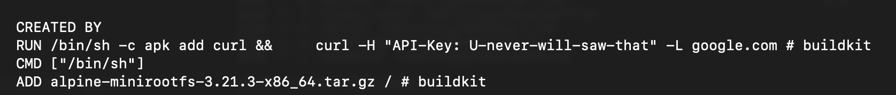

# Session 2

## Sécurisation Réseau

### 1. Éviter l’Exposition Involontaire de Ports

Lors du lancement d'un conteneur, nous pouvons spécifier quels ports restent ouverts et connectés avec l'hôte. Pour illustrer cela, nous allons lancer un conteneur Nginx, qui sera ouvert sur le port 8080 de l'hôte et le port 80 du conteneur :

```sh
docker run -d -p 8080:80 nginx
```

Pour vérifier si le port est exposé, nous pouvons utiliser la commande `docker ps` :


Nous pouvons constater la ligne `0.0.0.0:8080 -> 80`, indiquant que le port est bien ouvert. Nous pouvons également tester cette connexion avec un `curl` :

```sh
curl http://localhost:8080
```


### 2. Restreindre les Permissions d’Accès aux Fichiers Sensibles

Maintenant que nous avons lancé un conteneur en exposant un de ses ports sur l'hôte, nous allons voir comment restreindre les permissions du conteneur pour accéder aux fichiers de l'hôte.

Avec la commande suivante :

```sh
docker run -it --rm -v /etc/passwd:/mnt/passwd:ro alpine sh
```

Nous copions les données du fichier `/etc/passwd` de l'hôte dans le dossier `/mnt/passwd` du conteneur, avec seulement des permissions de lecture (option `ro`).

En effet, nous pouvons lire les données sans problème :


Mais lorsqu'on souhaite modifier le fichier, par exemple en ajoutant une ligne, cela n'est pas possible :


### 3. Auditer la Configuration d’un Conteneur avec Docker Bench

Nous allons maintenant découvrir l'outil Docker Bench for Security, qui permet d'auditer l'hôte et les conteneurs pour détecter d'éventuelles vulnérabilités.

Après son installation avec les commandes suivantes :

```sh
git clone https://github.com/docker/docker-bench-security.git
cd docker-bench-security/
```

Nous pouvons procéder à l'audit de l'hôte avec cette commande :

```sh
sudo sh docker-bench-security.sh
```

À la fin, dans notre cas, le résultat est le suivant :


Selon la documentation, cela signifie qu'il y a eu un problème d'accès à certains fichiers ou dossiers, donc le test n'a pas été complètement abouti.

Nous allons réessayer avec un conteneur `vulnerable/web-dvwa`, ce qui devrait donner un mauvais score. Le résultat obtenu est le suivant :


Ces résultats signifient que nous avons eu 7 "bonnes réponses" et 117 réponses mauvaises, indiquant que l'image est extrêmement vulnérable.

### 4. Stocker et Utiliser des Secrets

Dans cette partie, nous allons utiliser les secrets avec Vault, une application d'encryption as a service. Elle nous permettra de stocker des secrets, de créer des ACL (en plus de groupes et d'entités d'accès) pour gérer les secrets que nous devons garder.

La première étape consiste à lancer un conteneur Vault :

```sh
docker run --cap-add=IPC_LOCK -e 'VAULT_LOCAL_CONFIG={"storage": {"file": {"path": "/vault/file"}}, "listener": [{"tcp": { "address": "0.0.0.0:8200", "tls_disable": true}}], "default_lease_ttl": "168h", "max_lease_ttl": "720h", "ui": true}' -p 8200:8200 vault:1.13.3 server
```

Le site est désormais accessible à l'adresse 8200 de l'hôte. Nous allons tout d'abord créer un nouvel utilisateur pour simuler le fait d'avoir quelqu'un qui a besoin d'accéder au secret :


Ensuite, nous devons créer la règle ACL et l'associer à l'utilisateur qui vient d'être créé :


Dans la page de profil de l'utilisateur, nous ajoutons l'ACL dans les politiques de son token (qu'il recevra lorsqu'il sera connecté) :


Finalement, nous allons créer le fichier avec le secret, auquel nous accéderons avec le compte de l'utilisateur que nous avons créé :


Nous pouvons maintenant procéder à la récupération de la clé avec le compte de l'utilisateur. Pour cela, nous allons le faire avec des requêtes `curl` à travers notre conteneur Alpine, mais nous pouvons également utiliser les outils `vault-cli`.

La première requête sera de se connecter et de récupérer notre token de connexion, qui contient également la règle ACL nous permettant d'accéder à notre secret.

Dans notre cas, l'UI de Vault se situait à l'adresse IP `192.168.2.1`. Pour la retrouver sur votre machine, vous pouvez exécuter la commande `ifconfig` et utiliser l'adresse correspondant à l'interface qui lie le conteneur et l'hôte.

```sh
curl \
    --request POST \
    --data '{"password": "ruru"}' \
    http://[$IP_DU_HOTE]:8200/v1/auth/userpass/login/ruru
```

La réponse :

```json
{
  "request_id": "9d8568d4-a375-e226-e634-41f82b28ded3",
  "lease_id": "",
  "renewable": false,
  "lease_duration": 0,
  "data": null,
  "wrap_info": null,
  "warnings": null,
  "auth": {
    "client_token": {$CONNECTION_TOKEN},
    "accessor": {$ACCESSOR},
    "policies": ["access-container-secret", "default"],
    "token_policies": ["access-container-secret", "default"],
    "metadata": {"username": "ruru"},
    "lease_duration": 604800,
    "renewable": true,
    "entity_id": "6b976abb-34e5-4904-d7c9-63dae34b2fb6",
    "token_type": "service",
    "orphan": true,
    "mfa_requirement": null,
    "num_uses": 0
  }
}
```

Nous pouvons donc récupérer notre token, nommé `client_token`, pour se connecter au secret à travers le chemin configuré.

```sh
curl \
    --header "X-Vault-Token: [$TOKEN]" \
    http://[$IP_DU_HOTE]:8200/v1/kv/data/mon-secret
```

La réponse :

```json
{
  "request_id": "05a0f915-908b-d06f-a0fe-a06bd6d36b13",
  "lease_id": "",
  "renewable": false,
  "lease_duration": 0,
  "data": {
    "data": {"secret": "secsec"},
    "metadata": {
      "created_time": "2025-03-21T21:07:18.826750429Z",
      "custom_metadata": null,
      "deletion_time": "",
      "destroyed": false,
      "version": 1
    }
  },
  "wrap_info": null,
  "warnings": null,
  "auth": null
}
```

Notre secret (`secret: secsec`) a donc été récupéré avec succès.

# Session 2

## Sécurisation Réseau

### 5. Trouver la Clé

**Contexte :** Un développeur peu habile a construit une image Docker contenant une clé API utilisée dans une requête suspecte. En tant qu'attaquant, nous allons trouver cette clé API dans l'image Docker.

Tout d'abord, nous allons télécharger l'image pour pouvoir l'analyser :

```sh
docker pull ety92/demo:v1
```

Comme première analyse, nous pouvons utiliser des outils comme `grype` pour vérifier s'il existe des vulnérabilités connues stockées en ligne :

```sh
grype ety92/demo:v1
```


Nous pouvons voir qu'aucune vulnérabilité n'a été trouvée dans la base de données.

La prochaine étape consiste à vérifier si la clé n'a pas été codée en dur quelque part dans les fichiers. Pour cela, nous allons télécharger les fichiers de l'image et les scanner avec des mots-clés susceptibles de correspondre à une clé API :

```sh
docker save ety92/demo:v1 -o files.tar
tar -xvf files.tar
```

Une fois dans le dossier, nous pouvons effectuer la recherche :

```sh
grep -r -i "api_key" ./files
grep -r -i "access_token" ./files
grep -r -i "secret" ./files
grep -r -i "token" ./files
grep -r -i "password" ./files
```


Même si cela a produit des résultats, aucun des éléments ne semble correspondre à la valeur d'une clé API.

Nous pouvons maintenant essayer d'analyser le système de fichiers modifié lors du lancement du conteneur. En effet, lorsqu'on exécute la commande :

```sh
docker inspect ety92/demo:v1
```

Nous pouvons retrouver les informations du conteneur. Parmi ces informations, nous pouvons nous intéresser aux dossiers `MergedDir` et `UpperDir`. `MergedDir` correspond à la "fusion" du système de fichiers avant le lancement du conteneur avec `UpperDir`. Il suffirait d'analyser les deux dossiers et d'enregistrer les différences ou les changements.

```json
"GraphDriver": {
  "Data": {
    "LowerDir": "/var/lib/docker/overlay2/cb017d06d7be0294bf7e2c3753eef48096b915b157656c5534f104ad3752134e/diff",
    "MergedDir": "/var/lib/docker/overlay2/b28988a486406c3ab15445a78d6172cf7ab22fe9b8c4dc30938153b30b8f64f3/merged",
    "UpperDir": "/var/lib/docker/overlay2/b28988a486406c3ab15445a78d6172cf7ab22fe9b8c4dc30938153b30b8f64f3/diff",
    "WorkDir": "/var/lib/docker/overlay2/b28988a486406c3ab15445a78d6172cf7ab22fe9b8c4dc30938153b30b8f64f3/work"
  },
  "Name": "overlay2"
}
```

Mais avant cela, nous allons vérifier une dernière chose : l'autre point d'entrée pour une clé pourrait être au lancement du conteneur. En effet, comme nous l'avons fait précédemment pour accéder à notre Vault, il est possible que la clé API soit envoyée au moment du lancement des commandes du Dockerfile avec une commande `curl` ou autre. Pour vérifier cela, nous allons exécuter la commande suivante :

```sh
docker history ety92/demo:v1
```


Nous pouvons effectivement voir une commande `curl` dans la première ligne d'instructions. Pour la voir en entier, nous pouvons réexécuter la commande avec l'option `--no-trunc` :

```sh
docker history --no-trunc ety92/demo:v1
```



Nous avons donc enfin trouvé la clé, qui apparaît dans la requête `curl` lors du lancement du conteneur.

**Pour éviter ce risque, un développeur peut :**

1. **Éviter d'inclure la clé dans l'image elle-même** : Dans notre cas, elle a été codée en dur dans le Dockerfile, ce qui nous permet de la voir lorsqu'on analyse les traces des instructions exécutées.
2. **Utiliser des variables d'environnement** : Utiliser des fichiers `.env` ou des variables d'environnement au moment du lancement pour stocker les clés.
3. **Utiliser des services comme Vault** : Stocker les secrets dans des environnements de production sécurisés.