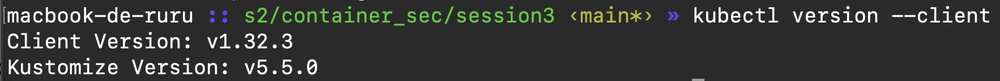

Absolument \! Voici le texte en Markdown, sans modifier les liens d'images :

````markdown
# Session 2

## Sécurité des orchestrateurs

### 1. Déploiement d'un cluster Kubernetes avec Kind

La première étape consiste à déployer un cluster Kubernetes avec deux nœuds maîtres et deux nœuds travailleurs. Pour ce faire, nous avons créé le fichier `kind_cluster.yaml`. Nous pouvons lancer le cluster à l'aide de la commande suivante :

```sh
kind create cluster --config kind_cluster.yaml
````


Pour vérifier l'état des pods, nous pouvons exécuter la commande `kubectl get pods` :

```sh
NAME                 STATUS   ROLES           AGE     VERSION
kind-control-plane   Ready    control-plane   2m      v1.28.0
kind-control-plane2  Ready    control-plane   2m      v1.28.0
kind-worker          Ready    worker          2m      v1.28.0
kind-worker2         Ready    worker          2m      v1.28.0
```

Pour afficher la liste des espaces de noms (namespaces), utilisez la commande suivante :

```sh
kubectl get namespace
```


Pour vérifier notre version de Kubernetes, utilisez la commande suivante :

```sh
kubectl version --client
```




### 2\. Expérimentation des RBAC (Contrôle d'accès basé sur les rôles)

Nous allons maintenant expérimenter avec les RBAC. Tout d'abord, nous devons créer un espace de noms (namespace) afin de séparer les clusters du système des autres :

```sh
kubectl create ns test-rbac
```

Dans cet espace de noms, nous allons déployer l'image suivante : `mon-pod.yaml`.

Pour afficher ses journaux, nous devons retrouver le nom du pod :


Puis, exécutez la commande suivante :

```sh
kubectl get pods -n test-rbac
```


```sh
kubectl get logs <nom-du-pod> -n test-rbac
```

Ensuite, nous créons des rôles pour définir les permissions d'accès aux ressources du cluster. Les rôles sont définis dans le fichier `role_mon_pod.yaml`.

Nous appliquons le rôle avec la commande suivante :

```sh
kubectl apply -f role_mon_pod.yaml
```

et nous affichons le rôle :


Cependant, un rôle seul ne suffit pas. Nous devons le lier à un utilisateur (dans notre cas, `ruru`) en utilisant le fichier `rebinding_role_mon_pod.yaml`, après l'avoir appliqué.


### 3\. Analyse d'un cluster Kubernetes avec Kube-bench

Nous allons maintenant analyser notre cluster avec l'outil `kube-bench`.

Après avoir téléchargé l'outil et créé le fichier `job.yaml`, nous pouvons lancer l'analyse :


```
... (Informations de version de Kube-bench) ...

=== Master Node Security Configuration ===
[PASS] 1.1.1 Ensure that the --anonymous-auth argument is set to false
[PASS] 1.1.2 Ensure that the --kubelet-client-certificate and --kubelet-client-key arguments are set as appropriate
[WARN] 1.1.3 Ensure that the --kubelet-certificate-authority argument is set as appropriate
...
[FAIL] 1.2.10 Ensure that the admission control plugin PodSecurityPolicy is set
...

Summary:
30 checks PASS
5 checks WARN
2 checks FAIL

=== Node Security Configuration ===
[PASS] 2.1.1 Ensure that the --kubelet-authentication-webhook argument is set to true
[PASS] 2.1.2 Ensure that the --kubelet-authorization-mode argument is not set to AlwaysAllow
...
[FAIL] 2.2.5 Ensure that the kubelet service file permissions are set to 644 or more restrictive
...

Summary:
25 checks PASS
3 checks WARN
1 check FAIL
```

Pour terminer l'analyse, il suffit de supprimer le pod `kube-bench` :


### 4\. Détection et alerte d'intrusions dans Kubernetes avec Falco

Nous allons maintenant utiliser Falco pour simuler des détections et des intrusions dans le cluster.

Nous devons créer un espace de noms (namespace) pour Falco, puis ajouter le dépôt Falco :

```sh
kubectl create ns falco
helm repo add falcosecurity [https://falcosecurity.github.io/charts](https://falcosecurity.github.io/charts)
helm repo update
```

Après cela, nous pouvons procéder à son installation :

```sh
helm -n falco install falco falcosecurity/falco --set falcosidekick.enabled=true --set falcosidekick.webui.enabled=true
```


### 5\. Falco en pratique

Pour simuler une activité, nous allons lancer un pod de test : `mon_pod_2.yaml`.

Ensuite, nous allons ouvrir un terminal et exécuter une commande :


En ouvrant le tableau de bord de Falco, nous pouvons constater cette activité directement dans l'interface utilisateur.


La priorité est faible, avec la règle "Terminal shell in container".

Nous allons tester à nouveau la détection d'activités avec une requête curl depuis l'intérieur du pod :

```sh
apk add curl
curl -k [http://10.96.0.1:80](http://10.96.0.1:80) # on ping l'API de Kubernetes
```


Nous pouvons donc constater son niveau de priorité et sa règle.

```
```
